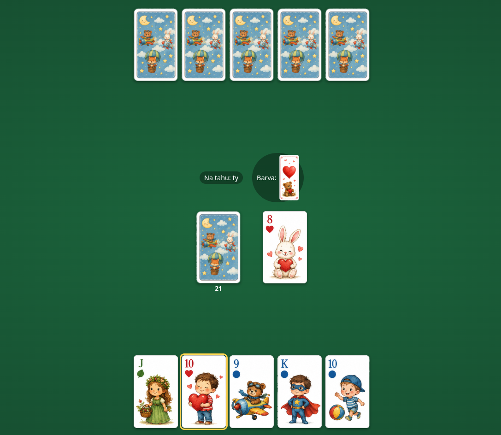

# Prší

Webová karetní hra **Prší** pro děti od 6 let — partie 1 na 1 proti počítači podle českých
pravidel. Karty mají dětské motivy a jsou odvozené od žolíkových karet: spodek = **J**,
svršek = **Q**, král = **K** a eso = **A**. Celá hra běží v prohlížeči, od rozdání po
výhru, bez přihlašování a bez serveru.



## Pravidla ve zkratce

- Hraje se s 32 kartami ve čtyřech barvách.
- Na vrchní kartu odhazovací hromádky smíš zahrát kartu **shodné barvy nebo hodnoty**.
- **Svršek (Q)** je žolík — můžeš ho zahrát na cokoliv a změníš jím požadovanou barvu.
- **Sedma** nutí soupeře líznout 2 karty. Sedmy se hromadí (max 4 = 8 karet),
  pokud soupeř přebije další sedmou.
- **Eso (A)** soupeře zastaví: musí ho **přebít vlastním esem**, nebo **stojí** a přijde
  o tah (líznout pod nakupenými esy nelze). Esa se hromadí; v souboji 1 na 1 tak po
  nepřebitém esu hraješ vzápětí znovu.
- Když nemáš hratelnou kartu, **líznéš si jednu** a tah končí. Líznout si můžeš ale
  i **dobrovolně kdykoliv jsi na tahu** — i s hratelnou kartou v ruce —, čímž tah předáš
  soupeři.
- Dojde-li lízací balíček, odhazovací hromádka (kromě vrchní karty) se zamíchá zpět.
- Vyhrává ten, kdo se **první zbaví všech karet**.

## Instalace a spuštění

Potřebuješ [Node.js](https://nodejs.org/) (verze 18+) a npm.

```bash
# instalace závislostí
npm install

# vývojový server s hot-reloadem (http://localhost:5173)
npm run dev

# produkční build do dist/
npm run build

# náhled produkčního buildu
npm run preview

# spuštění testů enginu
npm test
```

## Technologie

TypeScript + [Vite](https://vitejs.dev/), bez frameworku — vykreslování běží na čistém DOM.
Herní engine je oddělený od UI a je plně pokrytý testy.

## Licence

[MIT](LICENSE)
